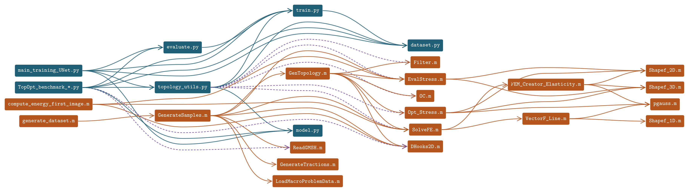

# A Task-Based Benchmark for Machine-Learning-Accelerated Topology Optimisation

*Research internship at the [Instituto Universitario de Ingeniería Mecánica y
Biomecánica (I2MB)](https://i2mb.upv.es/), Universitat Politècnica de València —
supervised by Juan José Ródenas García, Enrique Nadal Soriano and José Manuel
Navarro Jiménez.*


## Overview

This repository provides a full pipeline to accelerate 2D topology optimisation
with machine learning, and a benchmark protocol to compare accelerated methods on
equal footing.

The pipeline couples a Python optimisation loop to an existing I2MB **MATLAB**
FEM/SIMP solver (`OT_Functions/`, `OT_Software/`) through `matlab.engine`, running
each SIMP iteration with either the FEM or a fast surrogate prediction. Two
accelerated approaches are implemented on top of this loop:

1. **U-Net stress surrogate** — a neural network predicts the stress fields
   (σx, σy, τxy) instead of solving the FEM, and can be interleaved with FEM
   corrections through several hybrid strategies.
2. **Energy-distance warm start** — a database method that retrieves the
   converged geometry of the most similar already-solved case and starts the
   optimisation from it.

Both are evaluated with the same benchmark protocol: for a given test problem,
each method is compared to a full-FEM optimisation on two axes — the **cost**
(ratio of FEM iterations still required) and the **quality** (compliance
difference at convergence). This makes strategies, network architectures and
entirely different acceleration methods directly comparable.

My contributions live in `OT_NN/Pytorch_NN/`; the MATLAB code was provided by
I2MB (see Acknowledgements).


---

## Repository Structure
```text
├── Software/OT_NN/Pytorch_NN/
│   ├── model.py                    # UNetTopo, BE_UNetTopo, CBAM, BoundaryEmbedding
│   ├── train.py                    # Training loop + input/target tensor builders
│   ├── evaluate.py                 # Evaluation and visualisation
│   ├── dataset.py                  # Datasets, D4 data augmentation, energy warm start
│   ├── main_training_UNet.py       # Training entry point
│   ├── topology_utils.py           # Stress prediction (U-Net / FEM) + optimisation loop
│   ├── TopOpt_process.py           # Run one hybrid U-Net/FEM optimisation
│   ├── TopOpt_accelerated.py       # Energy-distance warm start + optimisation
│   ├── TopOpt_benchmark_*.py       # Benchmarks (architectures, models, hybrid strategy)
│   ├── training_benchmark.py       # Train several models and log results
│   ├── verify_rotation_consistency.py  # Checks the D4 augmentation is consistent
│   │
│   ├── results/{U-Net,BE_Unet}/{dataset}/   # checkpoints: *_best.pth, *_checkpoint.pth
│   └── illustrations/{U-Net,BE_Unet}/{dataset}/
│
├── Software/OT_Functions/          # I2MB FEM MATLAB code (stiffness, stress, tractions)
└── Software/OT_Software/           # I2MB TopOpt MATLAB code (SolveFE, GenTopology, mesh)
```

### Call graph



Every file reachable from the four entry points — `main_training_UNet.py`,
`TopOpt_benchmark_*.py`, `generate_dataset.m` and `compute_energy_first_image.m`.
Blue edges are Python imports, orange are MATLAB calls, and violet marks the
`matlab.engine` bridge. Both orchestrators — the MATLAB loop in
`GenerateSamples.m` and the Python loop in `topology_utils.py` — converge on the
same FEM core.

The graph is extracted from the sources rather than drawn by hand, so it stays
honest about commented-out calls and MATLAB path shadowing:

```bash
python tools/depgraph.py        # parse sources -> tools/out/depgraph.{dot,mmd,txt,json}
python tools/render_figures.py  # render figures as PDF / PNG / SVG / TikZ
```

The MATLAB engine is started once and kept alive for the whole optimisation
(`MeshData` stays resident in the workspace instead of being transferred at every
call). Each SIMP iteration's stress source — FEM or surrogate — is selected from
Python, which is what makes the hybrid strategies below possible.


---

## Problem set-up

A unit square `[-1, 1]²` meshed with 32×32 quad elements.

- **Loads (Neumann)** — a distributed traction on all four edges, defined by
  **8 boundary nodes** (2 per edge). Each node stores **`(Tn, Tt)` = (normal,
  tangential)** components in the edge-local frame — **not** global `(tx, ty)`.
  This convention is dictated by the MATLAB solver (`VectorF_Line.m`,
  `GenerateTractions.m`); the datasets are generated with self-equilibrated
  tractions (ΣF = 0, ΣM = 0).
- **Supports (Dirichlet)** — a **pin** at `(-1, -1)` (x and y fixed) and a
  **roller** at `(1, -1)` (y fixed). Three DOFs, removing the three rigid-body
  modes; the configuration has mirror symmetry.

---

## Surrogate models

### UNetTopo
Standard U-Net, 4 encoder/decoder levels, configurable convolutions per block,
optional CBAM attention at the bottleneck.

| Input | Output |
|---|---|
| ρ, tx, ty — `[B, 3, 32, 32]` | σx, σy, τxy — `[B, 3, 32, 32]` |

The `tx, ty` channels are built from the stored `(Tn, Tt)` by converting them to
**global** components and rasterising them at their **physical edge positions**
(`get_traction_distribution` / `train._tractions_to_maps`, kept identical so
training and inference feed the network the same representation).

### BE_UNetTopo
U-Net with a Boundary Embedding module: the 16 nodal traction scalars are encoded
by an MLP + `ConvTranspose2d` and concatenated at the bottleneck before CBAM.

| Input | Output |
|---|---|
| ρ — `[B, 1, 32, 32]` + nodes `[B, 16]` | σx, σy, τxy — `[B, 3, 32, 32]` |

All architecture hyperparameters (number of filters, convolutions per block, use
of CBAM, ...) are passed as constructor arguments, so a configuration is fully
described by a tuple — see `TopOpt_benchmark_architecture.py`.

---

## Data augmentation (D4, ×8)

Elasticity is equivariant under the symmetries of the square, so each sample can
be replicated under the **dihedral group D4** — the 4 rotations (0/90/180/270°),
each optionally mirrored — giving **8×** more physically-consistent data.

`dataset.py` transforms density, tractions **and** stress consistently:

- **density / stress** rotate as image / tensor fields (`torch.rot90`, with the
  σx↔σy swap and τxy sign change on odd rotations);
- **tractions** are transformed in the *global* frame: convert `(Tn, Tt)`→global,
  relocate + rotate the nodal vectors, convert back to the new edge's `(Tn, Tt)`
  (`transform_tractions`).

Entry points: `random_augment` (on-the-fly, per epoch) and
`AcceleratedDataset.augment` (materialised ×8 expansion).

> **Note on verification.** The augmentation rotates the *stored* stress `g·σ`
> (the true physical answer) — it never re-solves the FEM. Do **not** validate it
> with a FEM round-trip (`FEM(g·inputs) == g·FEM(inputs)`): the discrete FEM/mesh
> is only reflection-covariant, so that test fails for a general load even when the
> augmentation is correct. The right, load-independent check is
> `verify_rotation_consistency.py` (bending + shear, all 8 D4 elements ≈ 1e-11).

---

## Hybrid FEM/surrogate optimisation loop

`run_topology_optimization` (in `topology_utils.py`) runs SIMP-style optimisation
where each iteration's stress comes from either the U-Net or the FEM, selected by
the `RULE` string:

| `RULE` | Behaviour |
|---|---|
| `'Only FEM'` | every step uses the FEM (baseline / ground truth) |
| `'<n> Unet - <m> FEM'` | periodic: `n` fast U-Net steps then `m` FEM corrections |
| `'Decreasing compliance'` | U-Net until the compliance stops decreasing, then FEM |
| anything else | U-Net only |

`TopOpt_process.py` drives one such run and produces the iteration montage
(U-Net-driven vs FEM-driven geometries).

---

## Energy-distance warm start (accelerated method)

Instead of optimising from a uniform block, `AcceleratedDataset.closest_point`
retrieves a good **starting geometry** from a database of already-solved cases:

1. For every stored case, the **strain-energy field** of its *first (unoptimised)*
   image is kept (`Ener`, per element).
2. Given a new problem, its own first-image energy field is compared to every
   stored case by **squared error**, and the **closest** case is selected.
3. The new sample is initialised with that case's **converged density**, then the
   optimisation is run from there.

Because similar loads produce similar optimal topologies, this warm start lands
close to the optimum and converges in far fewer iterations. The database can be
grown ×8 with the same D4 augmentation (`AcceleratedDataset.augment`) so a single
solved case covers all 8 orientations. See `TopOpt_accelerated.py`.

---

## Benchmark protocol

The `TopOpt_benchmark_*.py` scripts provide a **common yardstick for any accelerated
topology-optimisation method**, independent of the machine, the implementation, or
the nature of the method itself (surrogate-based or not). Each method is run
against a set of test problems and compared to a full-FEM optimisation on two
axes:

- **Cost** — `Ratio of FEM iterations (Hybrid / full-FEM)`: how many expensive FEM
  solves the accelerated method still needs, relative to pure FEM. Lower = faster.
- **Quality** — `Relative compliance error`: how far the accelerated design's
  compliance is from the full-FEM optimum. Lower = more accurate.

The ideal method sits in the bottom-left corner (few FEM iterations, low error).

| Script | Compares | Output CSV |
|---|---|---|
| `TopOpt_benchmark_hybrid_strategy.py` | hybrid `RULE` strategies (Only UNet, `n Unet - m FEM`, Decreasing compliance, …) for a fixed model | `results/benchmark_hybrid_strategy.csv` |
| `TopOpt_benchmark_architecture.py` | network configurations (NIF, N_conv, CBAM, augmentation, dataset portion, …) | `results/benchmark_architecture.csv` |
| `TopOpt_benchmark_model.py` | full methods head-to-head, incl. the **energy-distance warm start** | `results/benchmark_model.csv` |

Each CSV row is one `(method, test problem)` pair, storing the configuration plus
the two metrics above (and the raw FEM-iteration counts), so results can be
aggregated per method. New accelerated methods only need to report these same two
numbers to be directly comparable. (`training_benchmark.py` and
`benchmark_smape_architecture.csv` additionally log the pure stress-prediction
accuracy — sMAPE — per architecture.)

Since all strategies/architectures/models are evaluated on the same test
problems, comparisons are paired: differences are assessed with confidence
intervals and a Wilcoxon signed-rank test rather than by comparing raw averages
(see the report for the full statistical protocol).


---

## Training

Edit `user` / `name_file` in `main.py`, adapt the `BASE` path to your folder, then:

```bash
python main.py
```

Monitor training:

```bash
tensorboard --logdir results/runs
```

---

## Loss function

Symmetric Mean Absolute Percentage Error (sMAPE):

$$\mathcal{L} = \frac{1}{N} \sum_i \frac{2|\sigma_i - \hat{\sigma}_i|}{|\sigma_i| + |\hat{\sigma}_i| + \varepsilon}$$

---

## Requirements

- Python 3.11
- PyTorch, torchvision, NumPy, SciPy, Matplotlib, pandas, Pillow, TensorBoard
- MATLAB Engine for Python (topology-optimisation loop / FEM) — installed from
  your MATLAB distribution, not from PyPI; its version must match your MATLAB
  release
- Optional: `h5py` (reading MATLAB v7.3 `.mat` files), `imageio-ffmpeg`
  (`.mp4` export of the optimisation history when no system ffmpeg is on PATH)
- Optional, for `tools/render_figures.py`: `pdflatex` and `pdftocairo`
  (poppler-utils)
- On Linux, `tkinter` needs the system package `python3-tk` (bundled with
  Python on Windows)

---

## Installation

```bash
conda create -n env_benchmark python=3.11
conda activate env_benchmark
pip install torch torchvision numpy scipy matplotlib pandas pillow tensorboard h5py imageio-ffmpeg
# MATLAB Engine for Python (required for the optimisation loop / FEM).
# Recent MATLAB releases (R2022b and later):
pip install matlabengine
# Older releases, from your MATLAB installation directory:
#   cd extern/engines/python && python setup.py install
# The engine version must match your MATLAB release; see MathWorks
# documentation for the compatible Python versions.
```


---

## Acknowledgements

The MATLAB codes used for finite-element computation and topology optimisation
were provided by the [I2MB laboratory](https://i2mb.upv.es/), which also hosted
this work and provided the computational resources used in this study. I am
grateful to Prof. Juan José Ródenas García, Prof. Enrique Nadal Soriano and
Prof. José Manuel Navarro Jiménez for their supervision, and to Clément Jailin
for introducing me to the I2MB team and following up on my progress.

### AI & Tools Assistance

Portions of this codebase were developed with the assistance of:
- **Claude** (Anthropic) — generating portions of PyTorch code, debugging the
  data-augmentation / traction conventions, harmonising comments and docstrings,
  and resolving Git issues. 
- **Grammarly** — spelling and grammar correction in documentation.

---

## License
This work is licensed under CC BY-NC-SA 4.0: you may share and adapt
it for non-commercial purposes, provided that you give appropriate
credit and distribute any adaptation under the same license.
